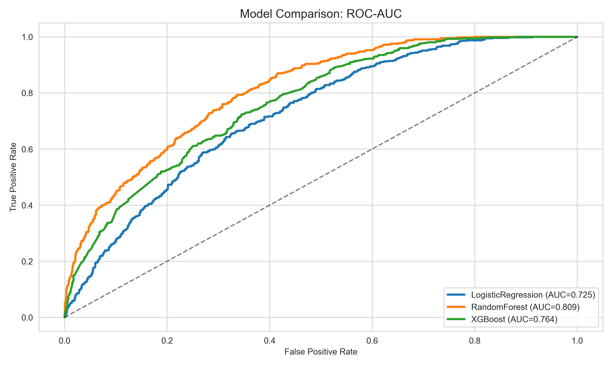
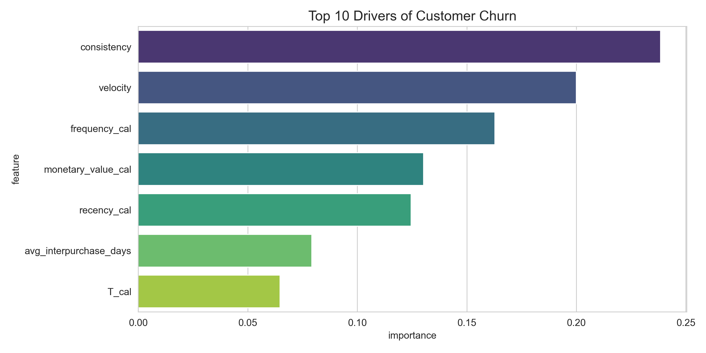
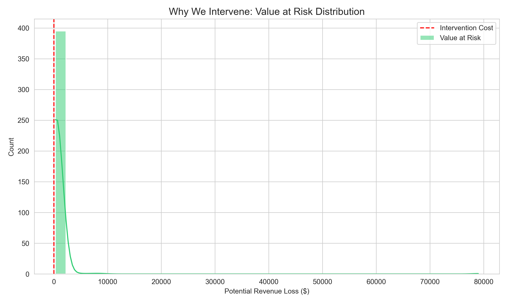
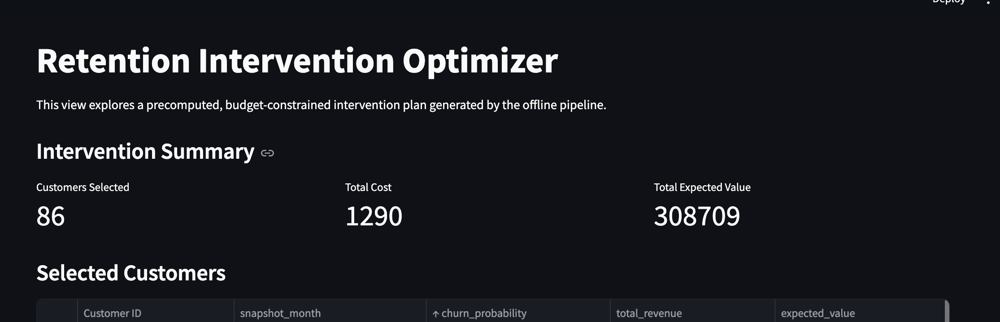
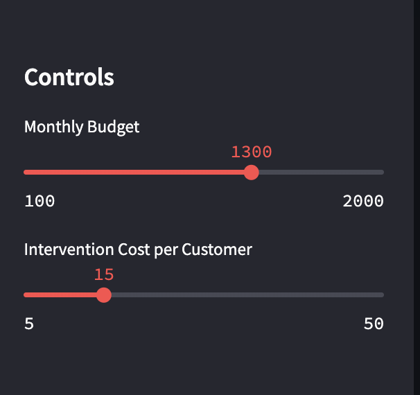
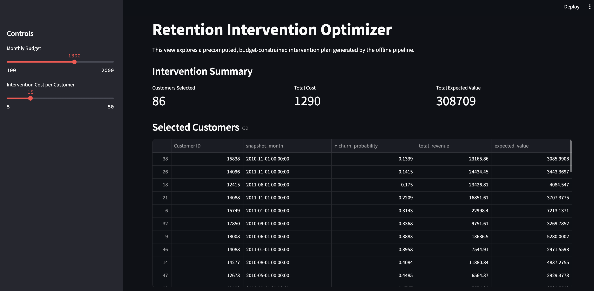

# Churn Prediction & Retention Optimizer

Predicts churn and customer lifetime value to optimize marketing spend — targeting customers based on expected loss (Value-at-Risk) rather than just churn probability.

**Stack:** Python, XGBoost, Scikit-Learn (Random Forest, Logistic Regression), Lifetimes (BG/NBD, Gamma-Gamma), FastAPI, Pydantic, Pytest

Most churn models answer: "Who is most likely to leave?"
This project answers: "Who is worth saving?"

---

## The Concept

Standard churn prediction treats all customers equally, which is capital-inefficient:
- Scenario A: A low-value customer ($50 LTV) with 90% churn risk. Expected loss: $45.
- Scenario B: A high-value customer ($5,000 LTV) with 20% churn risk. Expected loss: $1,000.

A standard classifier flags Scenario A. This approach targets Scenario B.

## Implementation

### Dual-Target Modeling
Two probabilistic streams run in parallel:
- Risk model — compares XGBoost, Random Forest, and Logistic Regression with 5-fold cross-validation to select the best classifier for P(Churn)
- Value model — BG/NBD (frequency) and Gamma-Gamma (monetary) models to predict future LTV

### Optimization
Budget allocation is solved as a knapsack problem:
- Calculate ValueAtRisk = P(Churn) × PredictedLTV
- Filter for positive ROI (expected loss > intervention cost)
- Allocate budget greedily to maximize total value protected

### Engineering
- The pipeline auto-downloads the dataset from UCI if it's missing locally
- In API mode, every request is serialized to a timestamped CSV in `logs/` for traceability
- Pydantic schemas reject malformed data (e.g., negative prices) at the API boundary

---

## Results

Dataset: Online Retail II (2010-2011), n=397,885.

### Model Comparison
Random Forest came out best with an AUC of 0.809, ahead of XGBoost (0.764) and logistic regression (0.725).



### Feature Importance
Consistency (regularity of purchase timing) and velocity (purchase acceleration) were the strongest churn predictors, followed by frequency and monetary value. The engineered behavioral features outperformed raw RFM columns.



### Budget Simulation
Constraint: $10,000 budget at $25 per intervention.

The optimizer selected 400 customers (100% utilization), focusing on the high-value tail of the Value-at-Risk distribution:

- Value protected: $306,954.70
- ROI: 30.7x



### Streamlit Dashboard

The interactive dashboard lets you adjust budget and cost-per-action parameters and see the intervention plan update in real time:







---

## Usage

### 1. Setup
```bash
pip install -r requirements.txt
```

### 2. Run batch pipeline
Triggers the full flow: ingestion, training, tuning, optimization.
```bash
python main.py run --budget 10000 --cost 25
```

### 3. API serving
Starts a FastAPI server for real-time scoring:
```bash
python main.py serve
```
- Endpoint: `POST /predict`
- Docs: `http://localhost:8000/docs`

### 4. Tests
```bash
pytest tests.py
```

---

Requires Python 3.11. This project uses the Online Retail II dataset.

> Chen, D., Sain, S.L., and Guo, K. (2012). Data mining for the online retail industry: A case study of RFM model-based customer segmentation using data mining. Journal of Database Marketing and Customer Strategy Management, Vol. 19, No. 3, pp. 197–208.
